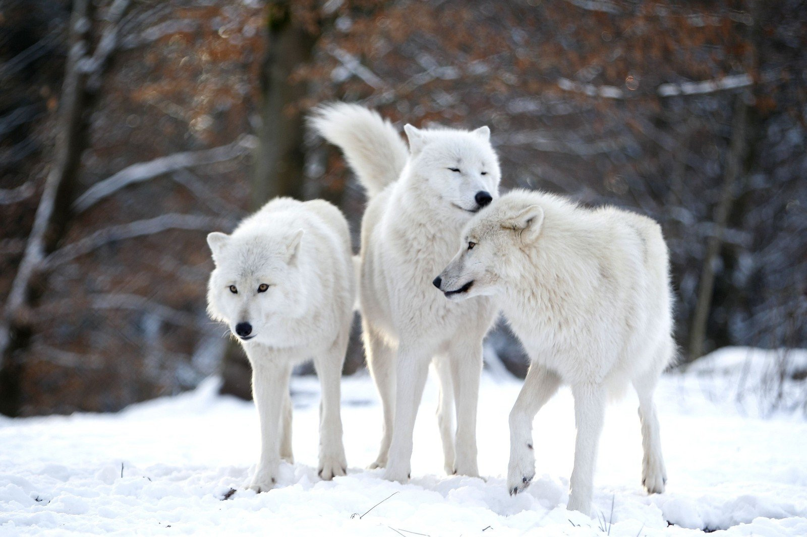

# wolf
хабарҳо оид ба гургон

# Волк

Материал из Википедии — свободной энциклопедии

Волк, или се́рый волк, или обыкнове́нный волк[1] (лат. Canis lupus), — вид хищных млекопитающих из семейства псовых (Canidae). Наряду с койотом (Canis latrans), обыкновенным шакалом (Canis aureus) и ещё несколькими видами составляет род волков (Canis). Кроме того, как показывают результаты изучения последовательности ДНК и дрейфа генов, является прямым предком домашней собаки (Canis familiaris; также классифицируется как подвид волка, Canis lupus familiaris). Волк — одно из самых крупных современных животных в своём семействе: длина его тела (без учёта хвоста) может достигать 160 см, длина хвоста — до 52 см, высота в холке — до 90 см; масса тела может достигать 90—110 кг.

Фотография волков

Источник: https://krasivosti.pro/uploads/posts/2021-04/1618237859_3-p-polyarnii-volk-volki-krasivo-foto-3.jpg

